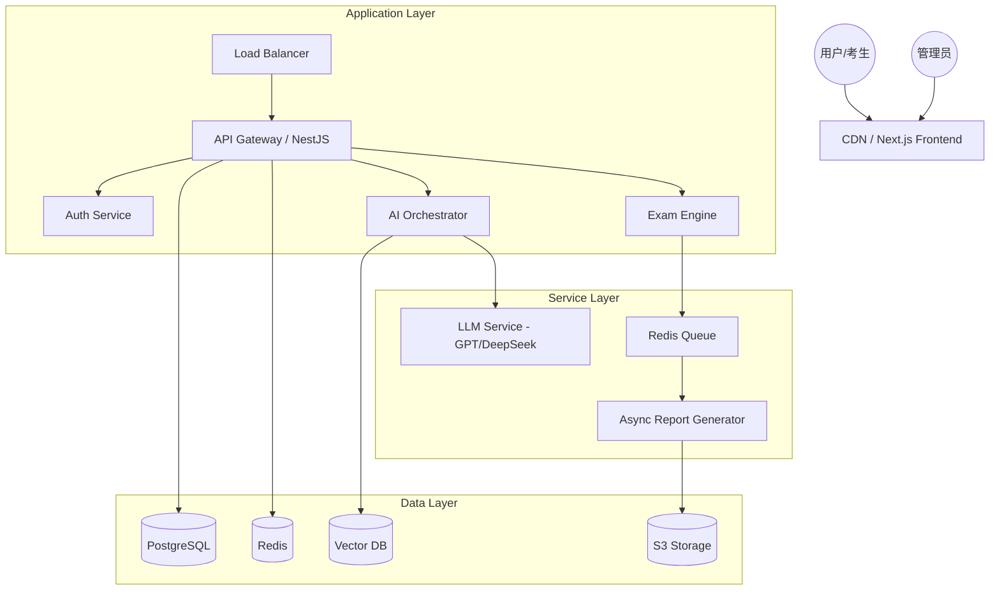
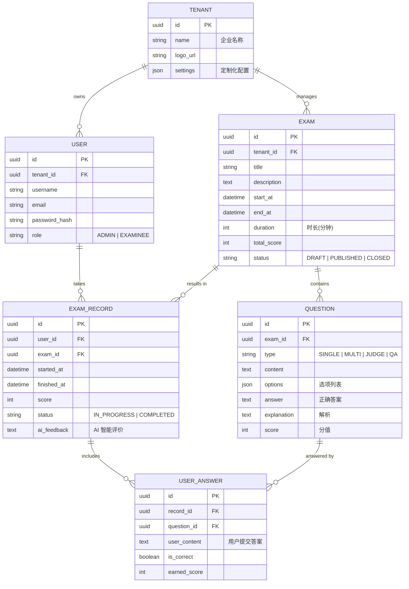

# 系统设计规格说明书 (System Design Specification)

## 1. 技术架构概览 (Technical Architecture Overview)

本系统采用高可用、可扩展的架构设计，旨在支持高并发在线考试、大规模题库管理及 AI 智能分析。

### 1.1 技术栈选型 (Technology Stack)
- **前端 (Frontend)**: React 18+, Next.js 14+ (App Router), Tailwind CSS, Shadcn/UI, Lucide React (图标), Zod + React Hook Form (表单校验)。
- **后端 (Backend)**: Node.js (NestJS) —— 提供强类型支持、模块化架构，适合处理复杂业务逻辑。
- **AI 引擎 (AI Engine)**: Python (FastAPI) —— 专门处理 PDF/DOCX 解析、OCR 及 LangChain/LlamaIndex 相关的 AI 密集型任务。
- **数据库 (Database)**: PostgreSQL (核心业务数据), Redis (缓存与分布式锁/延迟队列)。
- **AI/矢量检索**: OpenAI/DeepSeek API, Vector DB (Milvus 或 Pinecone) 用于知识库检索 (RAG)。
- **基础设施**: Docker 容器化部署, S3 兼容存储 (存储题目附件、报告)。

### 1.2 系统架构图 (Architecture Diagram)

---

## 2. 数据库模型设计 (Database Model Design)

数据库设计遵循第三范式，重点优化考试记录与题目关联，确保在高并发下的写入性能。

### 2.1 实体关系图 (ER Diagram)

---

## 3. 核心功能流程 (Core Workflows)

### 3.1 AI 智能出题流程
1. **上传文档**: 管理员上传 PDF/Word 知识库。
2. **文本解析**: 后端调用 Python 服务提取文本并生成 Embedding。
3. **向量化存储**: 文本切片存入 Vector DB。
4. **生成请求**: 结合 Prompt 模板与 RAG 检索到的知识片段，调用 LLM 生成题目。
5. **入库审核**: 管理员在前端预览并微调题目，确认后批量导入 `QUESTION` 表。

### 3.2 考试高并发保障
- **预热**: 考前将题目、考试配置缓存至 Redis。
- **异步写**: 考生答题过程先写入 Redis 暂存，交卷后通过消息队列异步同步至 PostgreSQL。
- **限流**: 在 API 网关层实施租户级限流，保护数据库。

---

## 4. 后续开发建议 (Development Roadmap)

- **Phase 1**: 基础框架搭建（NestJS + Next.js + PostgreSQL）。
- **Phase 2**: 实现基础出题与考试流程。
- **Phase 3**: 集成 AI 能力，实现自动出题与智能分析报告。
- **Phase 4**: 性能压测与多租户权限隔离优化。
